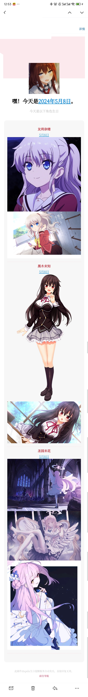

# 生日提醒服务
每天看到好友在空间发生日提醒，想到自己也可以做一个这样的服务。调研后发现bangumi虽然有详细的角色生日信息，但是图片一般般，不想放男角色（bushi）。acdb虽然提供虽然查询生日查询api但是角色不够，所以自己建一个

顺便用spring-native踩了一些坑

# 效果

展开查看

# TODO
- [ ] 接入OSS SDK
- [ ] 其他通知类型
- [ ] 数据导入